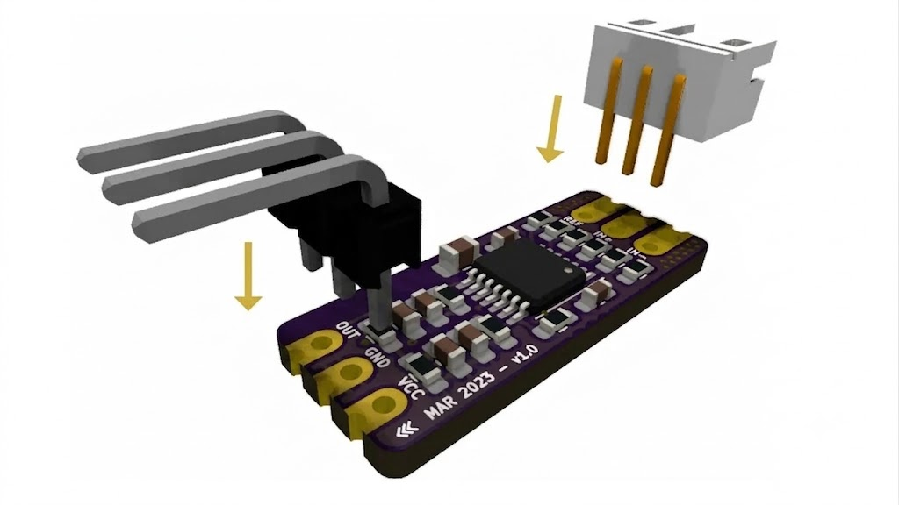
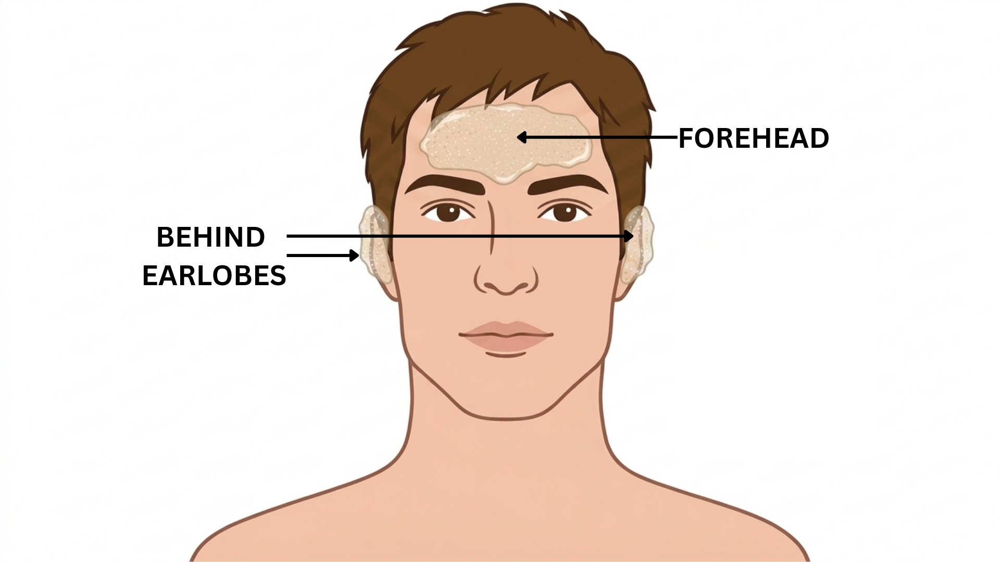
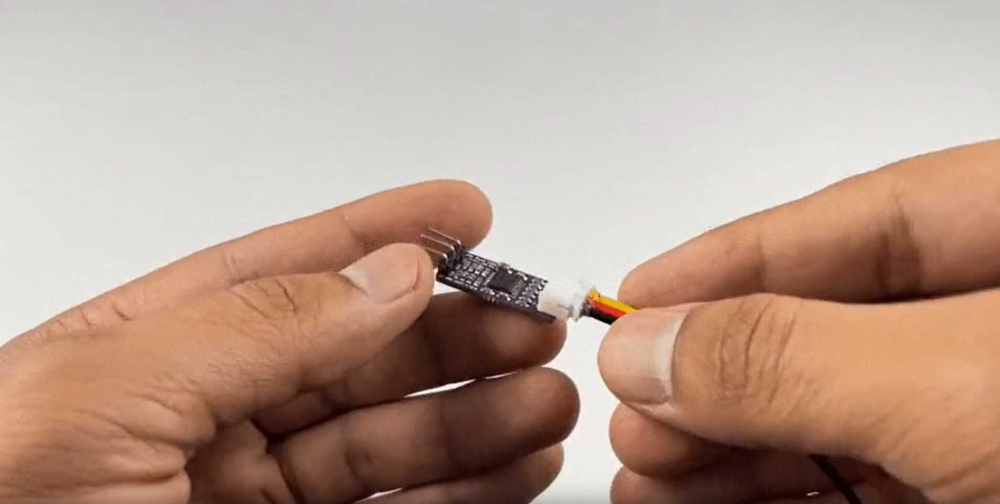
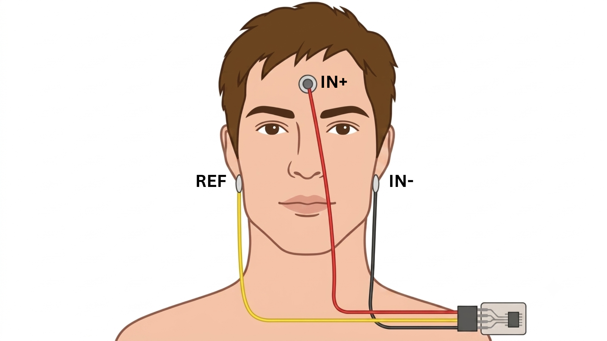

<h1 align="center">Drive Car using Brain</h1>

<p align="center">
  
  
  
</p>

<p align="center">
  
  
</p>

<p align="center">
"Invisible Driver" is a BCI project, in which you can drive video-game cars using brain's EEG signals.
</p>

### Hardware 

| Component | Image | Quantity |
| :--- | :---: | :---: |
| **BioAmp EXG Pill** *( (with JST PH 2.0 connector and a header pin))* |  | 1 |
| **BioAmp Cable v3** |  | 1 |
| **Gel Electrodes** |  | 3 |
| **Jumper Cables** |  | 3 |
| **Arduino Uno** |  | 1 |
| **Nuprep Skin Gel** |  | 1 |
| **Wet wipe** |  | 1 |
| **Brain BioAmp Band** *(Optional)* |  | 1 |
| **Electrode Gel** *(If using Brain BioAmp Band)* |  | 1 |

---

### Software 

* **Arduino IDE**
* **Visual Studio Code**
* **Google Colab**

---

### Hardware connection

#### Step 1: Assembly
If your BioAmp EXG Pill did not come pre-soldered, solder the header pins and the JST PH 2.0 connector onto the board.

<p align="center">
  
</p>

#### Step 2: Skin Preparation
Gently rub Nuprep Skin Preparation Gel onto your forehead and behind your earlobes to lower skin impedance and improve signal accuracy. Wipe the areas clean with a wet wipe.

<p align="center">
  
</p>

#### Step 3: Connecting Electrode Cable
Plug the BioAmp Cable v3 directly into the JST PH 2.0 connector on the BioAmp EXG Pill.

<p align="center">
  
</p>

#### Step 4: Electrode Placement
Snap the cable onto 3 gel electrodes and peel off their plastic backings. Place the **IN+** electrode on your forehead (between Fp1 and Fp2 positions). Place the **IN-** and **REF** electrodes on the bony areas behind your earlobes.

<p align="center">
  
</p>

#### Step 5: Connect Development Board
Use jumper cables to connect the BioAmp EXG Pill to your Arduino Uno / Maker Uno. 

**CRITICAL:** Double-check your VCC and GND connections. Reversing them can permanently damage your sensor.

* **VCC** = **5V**
* **GND** = **GND**
* **OUT** = **A0**

<p align="center">
  
</p>

---

### Software steps

#### Step 1: Clone the Repository

```bash
git clone [https://github.com/CoffeeIsAllYouNeed/Invisible-Driver.git](https://github.com/CoffeeIsAllYouNeed/Invisible-Driver.git)
cd Invisible-Driver

```

#### Step 2: Install Project Dependencies

```bash
pip install -r requirements.txt

```

#### Step 3: Flash the Arduino Hardware

1. Connect your EEG hardware module to your computer via USB.
2. Open the file located at `hardware/eeg.ino` using the Arduino IDE.
3. Select your correct board type and active communication port (e.g., `COM6`).
4. Click **Upload** to flash the code onto your hardware.

#### Step 4: Start the FastAPI Stream Server

Run the following command in your terminal to launch the high-speed async WebSocket server:

```bash
uvicorn server:app --reload --port 8000

```

#### Step 5: Launch the Interface Dashboard

Navigate: **`http://127.0.0.1:8000`**

---