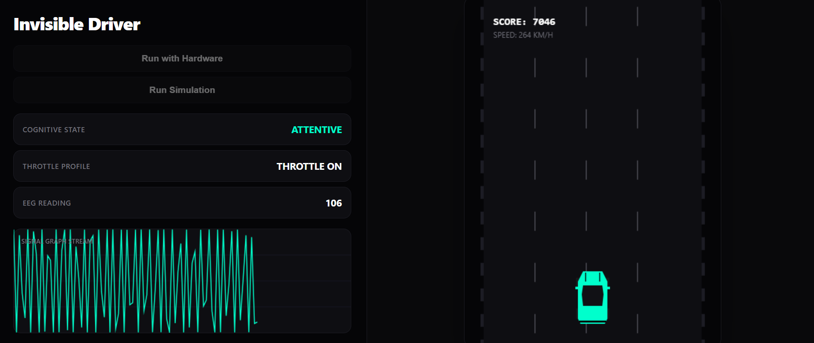
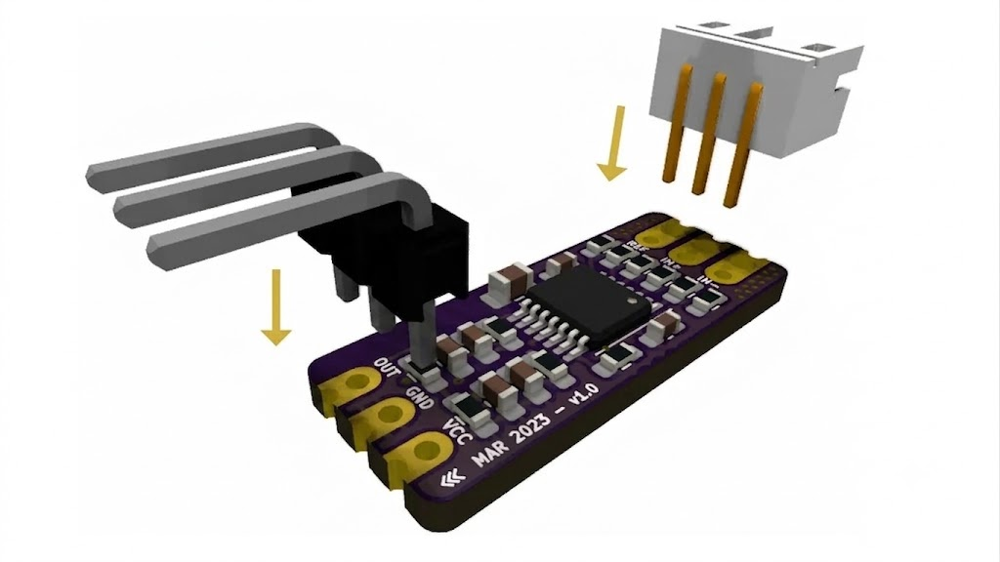
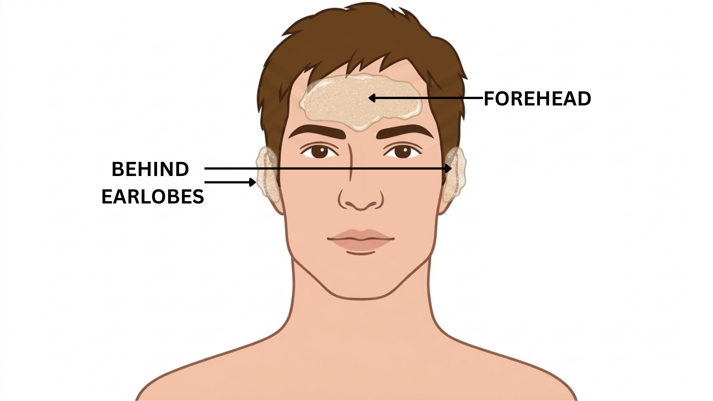
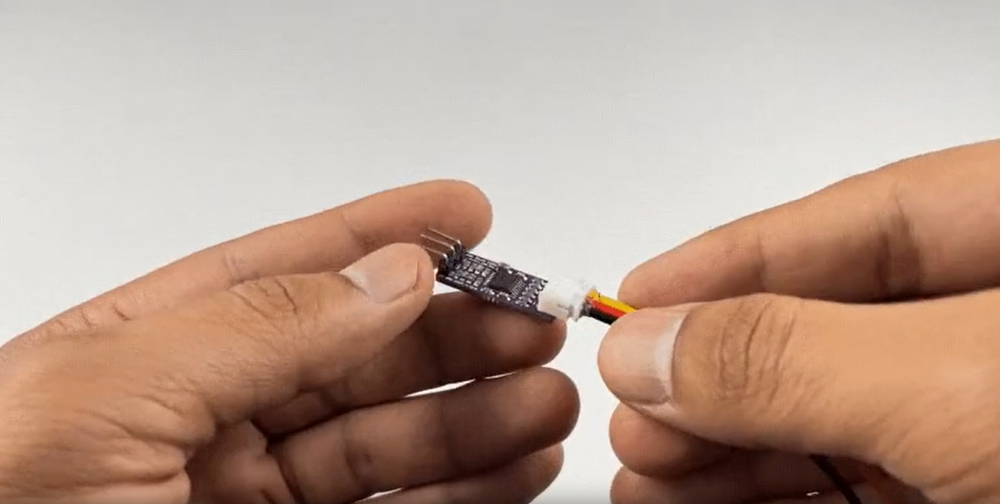
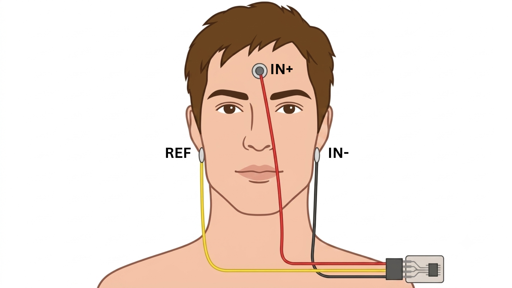
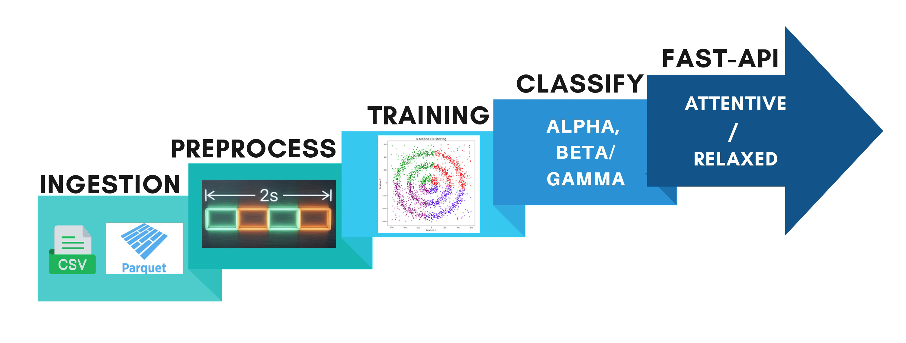

<p align="center">
  
  
</p>

<p align="center">
  
  
</p>

<p align="center">
  
  
  
</p>

<p align="center">
<em>Brain Computer Interface to drive video game cars with EEG signals.</em>
</p>

<br><br>
FOR **DETAILED DOCUMENTATION** VISIT [**HERE**](https://github.com/CoffeeIsAllYouNeed/Invisible-Driver/tree/main/docs)

## Play Guide: 

<p align="center">
  
  <br>
</p>

* If hardware is available, complete the setup as per instructions and run the server.
* If hardware is not available, run the server and run simulation.


## What are Brain Waves?

Brain waves refer to the electrical activity of the brain, characterized by different frequencies ranging from 0.1 to over 100 Hz, with specific classes including beta, gamma, alpha, theta, and delta waves, each associated with varying states of alertness, cognitive activity, and sleep.[[3]](#ref-3)


## What is Brain-Computer Interface?

A Brain–Computer Interface (BCI) establishes a direct communication pathway between the brain's bioelectrical activity and an external computational device, bypassing traditional neuromuscular pathways [[1]](#ref-1). 

<p align="center">
  
  <br>
  <em>Figure 1: Brain-Computer Interface(BCI)</em>
</p>


## What is EEG?

An electroencephalogram (EEG) is a test that measures electrical activity in the brain.[[2]](#ref-2) This test also is called an EEG.

<p align="center">
  
  <br>
  <em>Figure 2: Electroencephalogram(EEG)</em>
</p>


## Table of Contents: 

<div align="center">

| Content | Description |
| :---: | :---: |
| [Hardware](#hardware) | Hardware requirements |
| [Software](#software) | Software requirements |
| [Hardware Connection Steps](#hardware-connection-steps) | Steps to connect hardware |
| [Software Connection Steps](#software-connection-steps) | Steps to connect software |
| [Directory Structure](#directory-structure) | Repository layout |
| [Pipeline](#pipeline) | ML Pipeline steps |
| [Results](#results) | Evaluation Metrics |
| [References](#references) | References |
| [Wanna Chat?](#wanna-chat) | Contact Information |

</div>


## Hardware:  

<div align="center">

| Component | Image | Quantity |
| :---: | :---: | :---: |
| **BioAmp EXG Pill** <br>*(with JST PH 2.0 connector and a header pin)* |  | 1 |
| **BioAmp Cable v3** |  | 1 |
| **Gel Electrodes** |  | 3 |
| **Jumper Cables** |  | 3 |
| **Arduino Uno** |  | 1 |
| **Nuprep Skin Gel** |  | 1 |
| **Wet wipe** |  | 1 |
| **Brain BioAmp Band** <br>*(Optional)* |  | 1 |
| **Electrode Gel** <br>*(If using Brain BioAmp Band)* |  | 1 |

</div>


## Software: 

* **Arduino IDE**
* **Visual Studio Code**
* **Google Colab** (Optional)


## Hardware connection steps: 

### Step 1: Assembly
If your BioAmp EXG Pill did not come pre-soldered, solder the header pins and the JST PH 2.0 connector onto the board.

<p align="center">
  
</p>

### Step 2: Skin Preparation
Gently rub Nuprep Skin Preparation Gel onto your forehead and behind your earlobes to lower skin impedance and improve signal accuracy. Wipe the areas clean with a wet wipe.

<p align="center">
  
</p>

### Step 3: Connecting Electrode Cable
Plug the BioAmp Cable v3 directly into the JST PH 2.0 connector on the BioAmp EXG Pill.

<p align="center">
  
</p>

### Step 4: Electrode Placement
Snap the cable onto 3 gel electrodes and peel off their plastic backings. Place the **IN+** electrode on your forehead (between Fp1 and Fp2 positions). Place the **IN-** and **REF** electrodes on the bony areas behind your earlobes.

<p align="center">
  
</p>

### Step 5: Connect Development Board
Use jumper cables to connect the BioAmp EXG Pill to your Arduino Uno / Maker Uno. 

**CRITICAL:** Double-check your VCC and GND connections. Reversing them can permanently damage your sensor.

* **VCC** = **5V**
* **GND** = **GND**
* **OUT** = **A0**

<p align="center">
  
</p>

## Software connection steps: 

### Step 1: Clone the Repository

```bash
git clone https://github.com/CoffeeIsAllYouNeed/Invisible-Driver 
cd Invisible-Driver

```

### Step 2: Install dependencies

```bash
pip install -r requirements.txt

```

### Step 3: Flash Hardware

1. Connect EEG hardware module to computer via USB.
2. Open the file located at `hardware/eeg.ino` using the Arduino IDE.
3. Select board type and active communication port.
4. Click **Upload** to flash the code into the hardware.

### Step 4: Run the following command in terminal

```bash
uvicorn server:app --reload --port 8000

```

### Step 5: Navigate to the Game Platform to Drive with Brain

Navigate: **`http://127.0.0.1:8000`**

## Directory structure: 

```text
Invisible-Driver/
├── .github/
│   └── workflows/
│       └── python-package-conda.yml # CI pipeline configuration.
├── data/                    # Stores sample data & live data.
│   ├── data.csv             # Sample 5 min data for simulation.
│   └── signal.parquet       # Live data.
├── docs/                    # documentation.
│   ├── evaluation.md        # documentation for evaluation method & results.
│   ├── feature_engineer.md  # documentation for feature engineering.
│   ├── game.md              # documentation for game logic.
│   ├── hardware.md          # documentation for hardware & data collection.
│   ├── ingestion.md         # documentation for data ingestion.
│   ├── prediction.md        # documentation for model training.
│   ├── preprocess.md        # documentation for data preprocessing.
│   └── README.md            # Updates documentation.
├── hardware/                # hardware scripts.
│   └── eeg.ino              # Arduino C++ sketch for live EEG data fetch.
├── model/                   # Stores pre-trained models.
│   └── model.pkl            # Pre-trained unsupervised model.
├── notebooks/               # Jupyter notebooks for exploration and prototyping.
│   ├── eda.ipynb            # Exploratory Data Analysis.
│   └── prediction.ipynb     # Unsupervised model.
├── src/                     # Pipeline modules.
│   ├── __init__.py
│   ├── feature_engineer.py  # Pipeline step: Feature engineering.
│   ├── ingest.py            # Pipeline step: Data ingestion.
│   ├── prediction.py        # Pipeline step: Model training.
│   ├── preprocess.py        # Pipeline step: Data preprocessing.
│   └── reproducible.py      # Pipeline step: Reproducibility.
├── templates/
│   ├── index.html           # Racing car UI structure
│   ├── script.js            # Frontend logic, WebSocket handling & Canvas rendering
│   └── style.css            # Cyberpunk BCI terminal styling
├── .gitignore
├── environment.yml          # Conda environment configuration.
├── LICENSE                  # Open-source MIT distribution terms
├── README.md                # Project overview.
├── requirements.txt         # Dependencies.
├── run.py                   # Pipeline run file.
├── server.py                # FastAPI server.
└── test_pipeline.py         # Pipeline tests for CI runner execution.
```


## Pipeline: 

<p align="center">
  
  <br>
</p>

## Results: 

<div align="center">

| Metric | Score |
| :---: | :---: |
| **Silhouette Coefficient (↑)** | `0.916` |
| **Davies-Bouldin Index (↓)** | `0.114` |
| **Calinski-Harabasz Score (↑)** | `1210.847` |

</div>

## References: 

<a id="ref-1"></a>

[1] Wikipedia contributors, "Brain–computer interface," *Wikipedia, The Free Encyclopedia*, [Online]. Available: https://en.wikipedia.org/wiki/Brain%E2%80%93computer_interface.

<a id="ref-2"></a>

[2] Mayo Clinic Staff, "EEG (electroencephalogram) - About," *Mayo Clinic*, [Online]. Available: https://www.mayoclinic.org/tests-procedures/eeg/about/pac-20393875.

<a id="ref-3"></a>

[3] "Brain Waves," ScienceDirect Topics, Agricultural and Biological Sciences, [Online]. Available: https://www.sciencedirect.com/topics/agricultural-and-biological-sciences/brain-waves. 

[4] Cleveland Clinic Professional, "Electroencephalogram (EEG): What It Is, Purpose, Procedure & Results," *Cleveland Clinic*, [Online]. Available: [https://my.clevelandclinic.org/health/diagnostics/9656-electroencephalogram-eeg](https://my.clevelandclinic.org/health/diagnostics/9656-electroencephalogram-eeg).

[5] J. Melby, "Controlling Video Game Using Brainwaves (EEG)," Instructables. Available: [https://www.instructables.com/Controlling-Video-Game-Using-Brainwaves-EEG/](https://www.instructables.com/Controlling-Video-Game-Using-Brainwaves-EEG/)


## Wanna Chat?

* [My LinkedIn](https://www.linkedin.com/in/vrushal-more-2a5067330?utm_source=share&utm_campaign=share_via&utm_content=profile&utm_medium=android_app)


